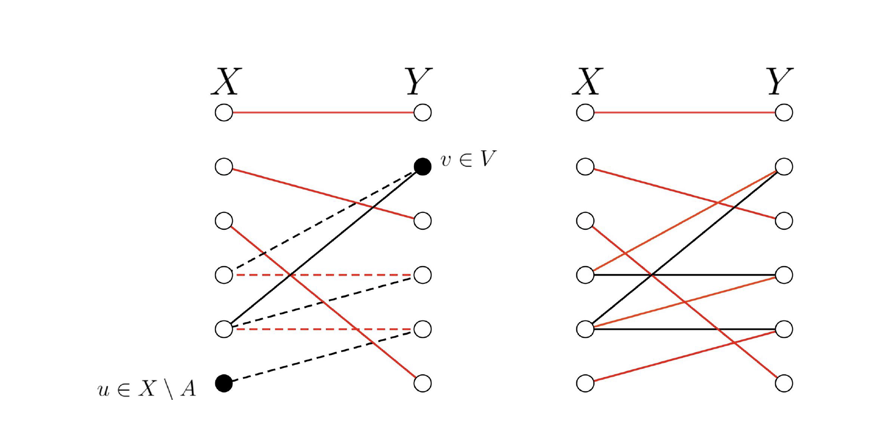

# Matchings
## Introduction 
We seek a method of finding a one factor matching for a bipartite graph. From Halls theorem, we have conditions which need to be satisfied in order for a one factor to exist, we will use this condition alongside the idea of an alternating path to attempt to create a program which simultaneously searches for a one factor and a blocking set should one exist. Finally, having found such a method we will extend it to maximal matchings for general graphs.

## Complexity of Naive approach

Checking each subset of X to see if it is a blocking set is a poor method of checking if there is a 1-factor matching. One reason is because in most cases the matching itself is important and therefore if we could find the one factor and check if we have a blocking set simultaneously the process would be much more computationally efficient. However, even in cases where we only want to establish the existence of a blocking set, we would need to check each subset of X individually. The number of operations would be some factor of:

Therefore o(2^n) operations, which is extremely inefficient for large n.

## A better approach 
A better approach is based in two simple claims. Consider a bipartite graph consisting of vertices sets X and Y with connecting edges.

**Claim 1.** Let M be a matching meeting the sets of vertices A   X and B Y. Let u  X  A and let V
be the subset of Y consisting of vertices reachable from u. Then if V  B then there exists a matching
larger than M.

*Proof.* Consider the alternating path U taking u to v  V, then let M' be the graph made up of the
edges in M which are not in U and the vertices that they join and U' be the set of edges in U but not in M and the vertices they join, then we claim that M' U', that is the set of vertices in M' or U' coupled with the edges in M' or U' is a larger matching in the sense that it contains more vertices.

Firstly, let m   M then either m is part of our alternating path or it is not. If m is not part of our alternating path then clearly by definition m  M' and therefore m  M'  U'. Otherwise, m is part of our alternating path which means that there exists i and j such that im  mj and im, jm are in U (since otherwise either m is an end point but it cannot be an end point since m in M or
m is not an end point then there must be at least two distinct edges leaving it since it is an alternating path and therefore we cannot go along an edge twice - that is to say either im in M or km in M in which case im, jm are distinct edges). Then this means m in U' since if im in M then jm in U' or if jm in M
then im in U'. So, the new matching is at least as big as M moreover, it contains the endpoints u and
v which were not in M so its bigger than M.

It remains to establish that this is in fact a 1-factor/matching. That is to say there do not exist multiple edges from one vertex in the path U for some m in M but by definition of a path, we only visit each vertex at most once. Therefore M' U' is a larger matching as claimed.

This proof is illustrated much more simply by the following example:

**Claim 2.** Let M be a matching meeting the sets of vertices A   X and B Y. Let u  X\A and let V be the subset of Y consisting of vertices reachable from u. Then if V  B then there exists a blocking set. 

*Proof.* There are two possibilities, either u does not reach anything, then u is a blocking set since this
means u has no neighbours since any neighbours of u form an alternating path of length 1. Or u reaches some things in B, call this set B' then since these B' vertices are included in the matching M then they must match to a subset A' in A which has size at least B' (since M is a 1-factor). Moreover, the neighbours of A' are B' since if we assume not then there exists m  some neighbor of A' that is not in B' but then m is a neighbour of some a in A' and so by defintion of A' there is some b in B' such that ab in M and b is reachable. Then either the
vertex a is not to the alternating path on which b is reachable, in which case we can add the edges ab and am (and it would continue to be alternating since M is a one factor and therefore there is only one edge containing b in M), then m is reachable from u and therefore m in B'. Or in the alternating path
on which b is reachable we do pass through a, but the edge ab in M and a in X as is u, therefore if the only way to b was through a we would require an odd number of edges in the path. Since u 62 A then the edge leaving u is not in M, therefore in order for the path to be alternating ab in M but this is a contradiction. Therefore the neighbours of A' are B'.
It is clear that neighbours of u are a subset of B' since the path given by just one edge of u is alternating. Hence |neighbours(A' + u)| = |neighbours(A')| = |B'| but since there is a matching from B' to A' then |A'| = |B'| therefore |A' + u| > |A'| = |neighbours(A' + u)|. So A' + u is a blocking set.

## Final Algorithm
1. Start with any matching M.
2. If all the vertices X are in M, then return M. Else, let u in X such that u not in M. Find the set, V of reachable vertices from u, if these already belong to M go to 3 otherwise go to 4.
3. Stop and print 'blocking set' size |V| + 1.
4. Pick any y in V unmatched, then using the methods of claim 1, augment M to M' U'. Return to 1.
